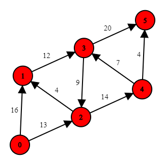

# Maximum-flow problem

[]
[]
[]
[]
[]
[]
[]

This project represents and solves Maximum-flow problem using the famous Ford-Fulkerson method. The repository contains codes for ```Graph``` data structure and it's supports. ```Graph``` represented using ```AdjacencyList```, below I leave some literature for those who is interested.

## Getting Started

These instructions will get you a copy of the project up and running on your local machine for development and testing purposes.

### Prerequisites

This project requires the following to be installed in your local machine:

- Windows 8/8.1/10
- Microsoft Visual Studio 2017 or upper
- Of course, there is a way to run this thing on Linux and Mac without ```Microsoft VS```, but I don't know how :)

### Installing

Just clone or download the repository and then open it as a ```Microsoft VS 2017``` project.

### Usage

#### Create a graph

The following piece of code will initialize an oriented weighted graph with 6 vertices:
```
Graph graph = Graph(6);

graph.addEdge(0, 1, 16);
graph.addEdge(1, 3, 12);
graph.addEdge(3, 5, 20);
graph.addEdge(0, 2, 13);
graph.addEdge(2, 4, 14);
graph.addEdge(4, 5, 4);
graph.addEdge(2, 1, 4);
graph.addEdge(3, 2, 9);
graph.addEdge(4, 3, 7);
```



#### Execute The Ford-Fulkerson method

1. Initialize a new graph.
2. Initialize a new flow by calling ```initializeFlow``` method.
3. Add some edges (possibly inside some try/catch block).
4. Call ```FordFulkersonAlgorithm``` method in order to calculate the value of the maximum-flow for the given graph.
```
Graph graph = Graph(6);
graph.initializeFlow();

try {
  graph.addEdge(0, 1, 16);
  graph.addEdge(1, 3, 12);
  // ...
}
catch (const exception& exception) {
  cout << exception.what() << endl;
  return 0;
}

int maxFlow = graph.FordFulkersonAlgorithm();
```


## Running the tests

The project doesn't have any test yet.

## Authors

See the list of [contributors](https://github.com/gevorgmelkumyan/max-flow-problem/contributors) who participated in this project.

## License

This project is licensed under the MIT License - see the [LICENSE.md](LICENSE.md) file for details

## Literature

[1] Ford, L. R., Jr., Fulkerson, D. R. (1962). _Flows in Networks_. Princeton, NJ.

[2] Cormen, T.H., Leiserson, C. E., Rivest, R. L. (2009). _Introduction to Algorithms, 3rd Edition_.

[3] Hemant, J. (2016). _Problem Solving in Data Structures & Algorithms Using C++, First Edition_.
